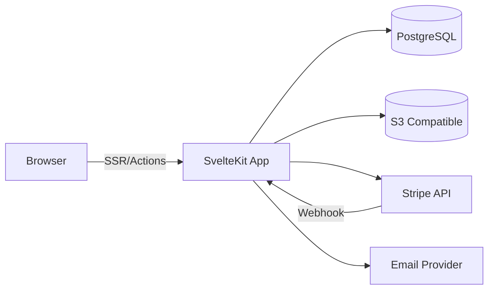
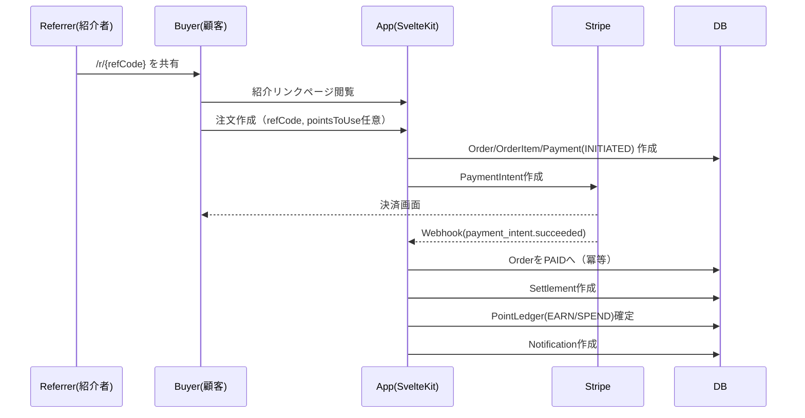
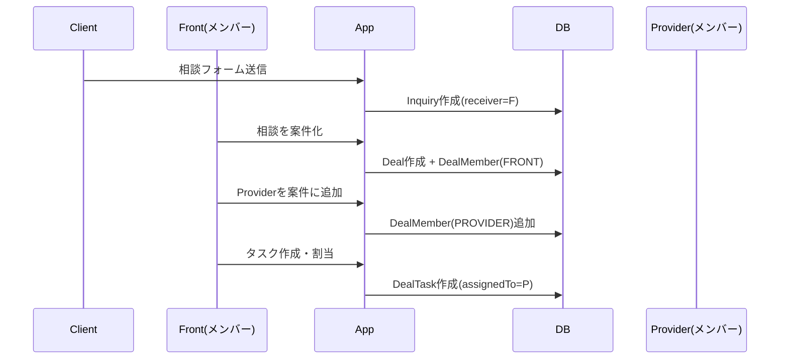

# 詳細設計書（SvelteKit 2 / Svelte 5 / Prisma 7）

最終更新: 2025-12-18

> 本書は「要件定義書（再設計版）」を前提に、MVP〜拡張を見据えた詳細設計の叩き台です。  
> 実装は DDD（ドメイン駆動設計）+ クリーンアーキテクチャをベースにし、設定値は `.env` 等へ分離します。

---

## 1. 技術スタック / 開発環境

### 1.1 フロント/サーバ

- **SvelteKit@2**
- **Svelte@5**
- Node.js: 20 LTS 以上（推奨）
- TypeScript: 有効（必須）

### 1.2 DB/ORM

- **Prisma@7**
- DB: PostgreSQL（推奨）
  - 理由: リレーション/トランザクション/検索要件に強い、Prismaとの相性が良い

### 1.3 決済

- Stripe（Payment Intents + Webhook）を前提に設計
  - 現金/銀行振込等は「手動入金登録」を併設

### 1.4 画像/ファイル

- ストレージ: S3互換（Cloudflare R2 / S3 等）を想定
- DBは `FileAsset(url, kind, ownerId, ...)` で参照を保持

### 1.5 通知

- MVP: メール + アプリ内通知（DB `Notification`）

---

## 2. システム構成（To-Be）

### 2.1 構成要素

- Webアプリ: SvelteKit（SSR + Server Actions + API endpoints）
- DB: PostgreSQL
- 決済: Stripe
- ストレージ: S3互換
- メール: SendGrid等（抽象化して差し替え可能）

### 2.2 簡易構成図（Mermaid）



---

## 3. アーキテクチャ設計（クリーンアーキテクチャ）

### 3.1 レイヤ方針

- **Domain（純粋）**: エンティティ/値オブジェクト/ドメインサービス/ポリシー
- **Usecase（アプリケーション）**: ユースケース（例: 注文作成、決済確定、ポイント付与）
- **Ports（インターフェース）**: Repository / PaymentGateway / Notifier / Storage 等
- **Infrastructure（実装）**: PrismaRepository、Stripe実装、Email実装、S3実装
- **Presentation（SvelteKit）**: routes / actions / endpoints

### 3.2 ドメインコンポーネント（機能モジュール）

DDDの境界（Bounded Context）をMVP向けに次のように分けます。

- **Onboarding**: 招待/審査/ユーザ有効化
- **ProfileTheme**: 公開プロフィール/テーマ（CSS変数）
- **Catalog**: 商品/価格/公開設定
- **Recommendation**: ルーム/ボード/紹介リンク
- **InquiryDeal**: 相談/案件/メンバー/タスク/顧客共有
- **Commerce**: 注文/決済（Stripe/手動）/精算台帳
- **Points**: ポイントルール/付与/利用/戻し/台帳
- **AdminOps**: 審査承認、手動入金、ポイント調整、監査ログ
- **Notification**: アプリ内通知/メール送信
- **FileAsset**: 画像/添付の管理

依存関係（例）:

- Recommendation → Catalog
- Commerce → Catalog, Points
- InquiryDeal → Catalog(提案作成時), Commerce(受注化時)

### 3.3 ディレクトリ構成案

```
src/
  routes/
    (public)/...
    (auth)/...
    (app)/...
    api/...
  lib/
    domain/
      entities/
      services/
      policies/
    usecases/
      commands/
      queries/
    ports/
      repositories/
      gateways/
      notifiers/
      storage/
    infrastructure/
      prisma/
      stripe/
      email/
      s3/
    server/
      auth/
      session/
      guards/
      zodSchemas/
    ui/
      components/
      styles/
```

---

## 4. コンポーネント設計

> Svelte 5 の runes（`$state`, `$derived`）を利用し、ページ内状態は局所化、グローバルは最小限にします。

### 4.1 共通UI（例）

- `Button`, `IconButton`
- `Input`, `TextArea`, `Select`
- `Badge`, `Tag`
- `Modal`, `Drawer`
- `Tabs`, `Stepper`
- `DataTable`
- `Toast`, `EmptyState`

### 4.2 ドメイン別UI

#### 商品（Product）

- `ProductForm`
  - sections:
    - 基本情報（title/summary/tags/category）
    - 料金（`PricingEditor`）
    - ポイント（`PointPolicyEditor` + `PointOfferEditor`）
    - 表示（`VisibilityEditor`）
    - 画像（`ImageUploader`）
- `ProductPreview`（公開ページのプレビュー）

#### ルーム（Board）

- `BoardEditor`
- `BoardItemEditor`
- `ProductPickerModal`
- `BoardSharePanel`（共有リンク生成）

#### 相談/案件（Inquiry/Deal）

- `InquiryCard`（案件化ボタン）
- `DealStageStepper`
- `DealMemberList`（ロールと顧客表示切替）
- `DealTaskList`（顧客公開ON/OFF）
- `DealCommentTimeline`（内部/顧客公開を分離）
- `DealDocumentEditor`（提案/見積/請求メモ）

#### 注文/決済（Order）

- `CheckoutSummary`
- `PointsRedeemBox`（上限/残高/換算表示）
- `PaymentMethodSelector`
- `StripeCardForm`
- `OrderReceipt`

#### ポイント（Points）

- `PointBalanceCard`
- `PointLedgerTable`

---

## 5. ページ設計（ルーティング/画面一覧）

### 5.1 公開（ログイン不要）

- `/u/[slug]` 公開プロフィール + ルーム入口
- `/u/[slug]/room` ルーム（おすすめ一覧）
- `/p/[productId]` 商品ページ（提供者標準ビュー）
- `/r/[refCode]` 紹介リンクページ（フロントのブランドで表示）
- `/client/deals/[token]` 顧客向け案件閲覧（ログイン不要）

### 5.2 認証/審査

- `/invite/[code]` 招待登録
- `/register` `/login`
- `/screening` 審査フォーム（提出→審査中表示）

### 5.3 アプリ（ログイン必要）

- `/app/dashboard`
- `/app/products` `/app/products/new` `/app/products/[id]/edit`
- `/app/room`
- `/app/inquiries`
- `/app/deals` `/app/deals/[id]`
- `/app/orders`
- `/app/points`
- `/app/settings/profile` `/app/settings/theme`
- `/app/admin`（管理者）

---

## 6. スタイル設計（Design System / Theme）

### 6.1 方針

- MVPは **CSS Variables（テーマ） + コンポーネント集約** を優先
- Tailwind等ユーティリティCSSは「採用してもよい」が必須ではない
  - v0.dev で作ったモックを移植しやすくするなら Tailwind採用が現実的

### 6.2 テーマ（CSS変数）例

- 色: `--color-primary`, `--color-accent`, `--color-bg`, `--color-text`
- 形: `--radius-md`
- 影: `--shadow-sm`
- フォント: `--font-sans`

### 6.3 適用規約

- `/u` `/r` は **表示主体（フロント/オーナー）** のThemeを優先
- `/p` は **提供者** のTheme（ただし referral経由はフロント優先）

---

## 7. DB設計（Prisma）

### 7.1 スキーマ

- Prismaスキーマは `03_schema.prisma` を参照（PostgreSQL想定）

### 7.2 主要モデル一覧（要点）

- `User`: メンバー。案件ごとにFront/Providerになる（ユーザ種別固定なし）
- `Product`: サービス商品。提供者（owner）が作成
- `PointPolicy`/`PointOffer`: 提供者が自由にポイント設定（商品デフォルト＋パートナー別上書き）
- `Board`/`BoardItem`: 楽天ROOM的おすすめ
- `ReferralLink`: 紹介リンク（提供者表示レベルも保持）
- `Inquiry`: 相談の入口
- `Deal`: 案件（相談→ヒアリング→…→完了）
- `DealMember`: 案件ごとのロール（Front/Provider/Collaborator）
- `Order`/`Payment`: 受注/決済（Stripe/手動）
- `Settlement`: 精算台帳（フロント受注/外注を含めた「誰にいくら」）
- `PointLedger`: ポイント台帳（入金で確定、キャンセルで戻す）
- `DealShareToken`: 顧客共有リンク（登録なしOK）
- `AuditLog`: 手動操作の証跡
- `FileAsset`: 画像/添付の参照
- `Notification`: アプリ内通知

### 7.3 データディクショナリ（抜粋）

#### User

- `status`: PENDING/ACTIVE/SUSPENDED
  - 審査承認後に ACTIVE
- `slug`: 公開ページURL

#### Product

- `providerVisibilityDefault`: FULL/PARTIAL/HIDDEN
- `acceptPoints`: ポイント利用可否
- `maxPointRedeemRate`: 商品ごとの上限（nullなら全体既定値）

#### PointPolicy / PointOffer

- `PointPolicy`: 商品デフォルト
- `PointOffer`: `productId + partnerId` で一意（パートナー別上書き）

#### ReferralLink

- `referrerId`: 紹介者（ポイント受給者候補）
- `providerVisibility`: このリンク経由の表示ルール

#### Deal / DealMember / DealTask

- `Deal.stage`: 相談→完了のステータス
- `DealMember.role`: FRONT/PROVIDER...
- `isClientVisible`: 顧客共有リンクに出すかどうか（タスク/メンバー/コメントで制御）

#### Order / OrderItem / Payment

- `Order.contractType`: DIRECT_PROVIDER / FRONT_RESELL
- `Order.sellerId`: 顧客との契約主体
- `Order.referrerId`: ポイント付与対象（紹介者）をスナップショット
- `OrderItem.providerId`: 実作業提供者（sellerと異なることがある）
- `Payment.stripeEventId`: Webhook冪等性キー

#### PointLedger

- `eventKey`: "stripe:evt_xxx:earn" のように冪等性担保（重複付与防止）
- `status`: PENDING/CONFIRMED/CANCELLED（予約→確定にも利用可能）

---

## 8. 権限設計（アクセス制御）

### 8.1 基本原則

- 公開ページ以外はログイン必須
- 重要データ（注文/ポイント/顧客情報）は「関係者のみ」
- 手動確定や調整は監査ログ必須

### 8.2 権限マトリクス（例）

| 機能                         | 実行可能                              |
| ---------------------------- | ------------------------------------- |
| 商品編集                     | 商品owner                             |
| ポイント設定（Policy/Offer） | 商品owner（提供者）                   |
| ルーム編集                   | ルームowner                           |
| 相談閲覧                     | 相談receiver                          |
| 案件編集（ステージ更新）     | Deal.owner（Front）/ 管理者           |
| 案件メンバー追加             | Deal.owner（Front）/ 管理者           |
| タスク作成                   | Deal.owner / DealMember               |
| タスク完了                   | 担当者 / Deal.owner                   |
| 顧客共有リンク発行           | Deal.owner / 管理者                   |
| 注文作成                     | 顧客/メンバー（公開導線はゲストも可） |
| 手動入金確定                 | seller / 管理者（監査ログ）           |
| ポイント調整                 | 管理者                                |

---

## 9. API設計（SvelteKit Endpoints / Actions）

> MVPでは Server Actions中心（フォーム送信）にし、外部公開が必要な箇所だけ `/api` を提供。

### 9.1 主要エンドポイント例

#### Webhook

- `POST /api/webhooks/stripe`
  - 受信イベントを `Payment.stripeEventId` で冪等処理
  - `ConfirmPayment` ユースケースを呼ぶ

#### 注文

- `POST /api/orders`
  - request: `{ items: [{productId, qty}], referralCode?, pointsToUse?, contractType? }`
  - response: `{ orderId, paymentRequired: true/false }`

#### 相談

- `POST /api/inquiries`
  - 公開フォーム（/u, /p, /r）から送信される想定

---

## 10. ユースケース詳細（重要フロー）

### 10.1 CreateOrder（注文作成）

入力:

- buyer（ユーザ or ゲスト）
- items（productId, qty）
- referralCode（任意）
- pointsToUse（任意）
- contractType（DIRECT_PROVIDER / FRONT_RESELL）

処理:

1. 商品の公開状態/価格/ポイント利用可否を検証
2. referralCode があれば `ReferralLink` を特定し、`referrerId` と `providerVisibility` を確定
3. pointsToUse があれば（買い手がユーザの場合のみ）残高と上限を検証
4. `Order`, `OrderItem` を作成（ポイント・表示ルールはスナップショット）
5. pointsToUse を **予約** する場合:
   - `PointLedger(type=SPEND, status=PENDING, points=-N, eventKey="order:xxx:reserve")`
   - `PointAccount.balance` は予約時点で引く or 確定時に引く（運用で選択）
6. Payment 生成（Stripeならintentは別ユースケースで生成）

### 10.2 CreateStripePaymentIntent（決済開始）

- Order.totalAmount を元に PaymentIntent を生成
- Payment レコードに `stripePaymentIntentId` を保存

### 10.3 ConfirmPayment（入金確定）

トリガ:

- Stripe Webhook
- 手動入金確定（現金）

処理（トランザクション推奨）:

1. Orderが `PENDING_PAYMENT` の場合のみ `PAID` に遷移
2. Settlement生成
   - PLATFORM_FEE（未確定なら0でも可）
   - SELLER_PAYOUT
   - PROVIDER_PAYOUT（ラッピング/外注がある場合）
3. ポイント確定
   - 予約していた `SPEND(PENDING)` を `CONFIRMED` に
   - 紹介者がいる場合: `EARN(CONFIRMED)` を作成
4. Notification生成 + Email送信（非同期でも可）

冪等性:

- StripeイベントIDや PaymentIntent をキーに `eventKey` を作り重複生成を防ぐ

### 10.4 Cancel/Refund（キャンセル/返金）

1. Order を CANCELLED/REFUNDED
2. 付与済みポイントがあれば `REVERSAL` を作成
3. 予約ポイントは `CANCELLED` にして戻す

---

## 11. 監査ログ（AuditLog）

対象:

- 手動入金確定
- ポイント調整
- 審査承認/否認
- 重要ステータス変更

形式:

- actorUserId + action + entityType/entityId + payload(JSON)

---

## 12. シーケンス図（主要フロー）

### 12.1 紹介リンク→購入→ポイント付与（Stripe）



### 12.2 相談→案件化→チームでタスク分解



---

## 13. `.env` 設定例

- `DATABASE_URL=...`
- `SESSION_SECRET=...`
- `STRIPE_SECRET_KEY=...`
- `STRIPE_WEBHOOK_SECRET=...`
- `POINTS_RATE_YEN=1`（1pt=1円相当）
- `POINTS_MAX_REDEEM_RATE_DEFAULT=0.3`
- `PLATFORM_FEE_RATE=0.05`（収益モデル未確定のため暫定）

---

## 14. 実装メモ（Prisma/トランザクション）

- `ConfirmPayment` は **必ずトランザクション**（Order更新 + Settlement + PointLedger + Notification）
- 冪等性は
  - `Payment.stripeEventId`（unique）
  - `PointLedger.eventKey`（unique）
    で担保し、二重付与を防ぐ
