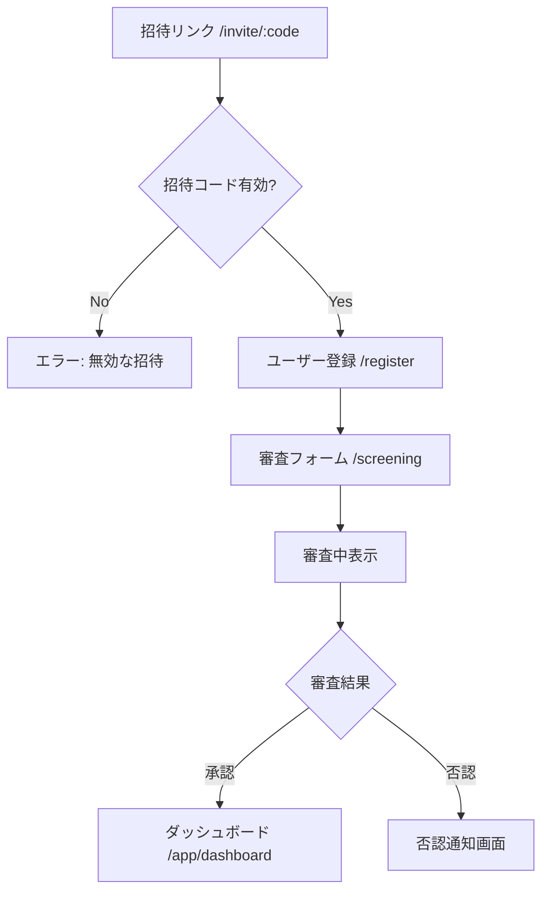
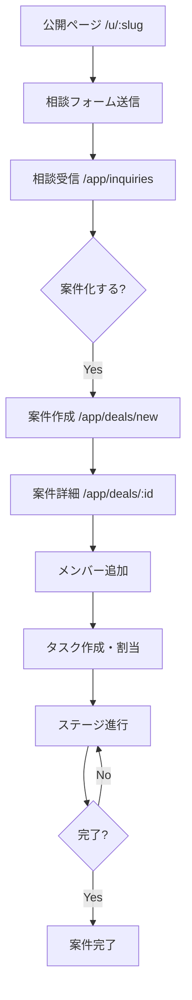
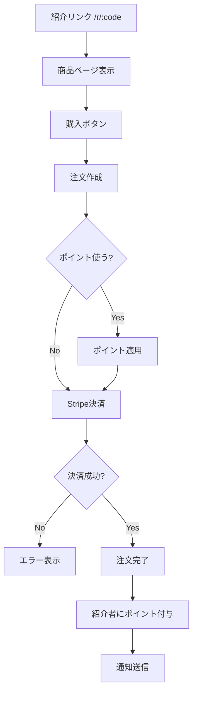

# UI設計書
最終更新: 2025-12-19

## 1. 技術選定

| カテゴリ | 選定 | 理由 |
|---------|------|------|
| UIライブラリ | **shadcn-svelte** | カスタマイズ性◎、Tailwind前提、コピペで所有権 |
| CSSフレームワーク | **Tailwind CSS v4** | shadcn-svelteとの相性、ユーティリティファースト |
| アイコン | **Lucide Svelte** | shadcnと統一、軽量、豊富なアイコンセット |
| フォーム | **Superforms + Zod** | SvelteKit最適、サーバー/クライアント両対応 |
| 日付操作 | **date-fns** | 軽量、Tree-shaking対応 |
| トースト | **svelte-sonner** | shadcn-svelteと統合済み |

---

## 2. デザインシステム

### 2.1 カラーパレット

CSS変数ベース（Tailwindのカスタムカラーとして定義）。
ダークモードは初期スコープ外、将来対応可能な構造にしておく。

```css
:root {
  /* Primary - ブランドカラー */
  --color-primary-50: #f0f9ff;
  --color-primary-100: #e0f2fe;
  --color-primary-500: #0ea5e9;
  --color-primary-600: #0284c7;
  --color-primary-700: #0369a1;

  /* Neutral - グレースケール */
  --color-neutral-50: #fafafa;
  --color-neutral-100: #f5f5f5;
  --color-neutral-200: #e5e5e5;
  --color-neutral-300: #d4d4d4;
  --color-neutral-400: #a3a3a3;
  --color-neutral-500: #737373;
  --color-neutral-600: #525252;
  --color-neutral-700: #404040;
  --color-neutral-800: #262626;
  --color-neutral-900: #171717;

  /* Semantic */
  --color-success: #22c55e;
  --color-warning: #f59e0b;
  --color-error: #ef4444;
  --color-info: #3b82f6;

  /* Background / Surface */
  --color-bg: #ffffff;
  --color-surface: #fafafa;
  --color-border: #e5e5e5;
}
```

### 2.2 タイポグラフィ

```css
:root {
  --font-sans: "Inter", "Noto Sans JP", system-ui, sans-serif;
  --font-mono: "JetBrains Mono", monospace;

  /* Font sizes (rem) */
  --text-xs: 0.75rem;    /* 12px */
  --text-sm: 0.875rem;   /* 14px */
  --text-base: 1rem;     /* 16px */
  --text-lg: 1.125rem;   /* 18px */
  --text-xl: 1.25rem;    /* 20px */
  --text-2xl: 1.5rem;    /* 24px */
  --text-3xl: 1.875rem;  /* 30px */

  /* Line heights */
  --leading-tight: 1.25;
  --leading-normal: 1.5;
  --leading-relaxed: 1.75;
}
```

### 2.3 スペーシング

Tailwindデフォルトの4pxベースを採用。

```
4px  = space-1
8px  = space-2
12px = space-3
16px = space-4
20px = space-5
24px = space-6
32px = space-8
40px = space-10
48px = space-12
64px = space-16
```

### 2.4 角丸・シャドウ

```css
:root {
  --radius-sm: 0.25rem;  /* 4px */
  --radius-md: 0.5rem;   /* 8px */
  --radius-lg: 0.75rem;  /* 12px */
  --radius-full: 9999px;

  --shadow-sm: 0 1px 2px 0 rgb(0 0 0 / 0.05);
  --shadow-md: 0 4px 6px -1px rgb(0 0 0 / 0.1);
  --shadow-lg: 0 10px 15px -3px rgb(0 0 0 / 0.1);
}
```

---

## 3. レスポンシブ戦略

### 3.1 ブレークポイント

モバイルファーストで設計、デスクトップも考慮。

| 名前 | 幅 | 用途 |
|------|-----|------|
| sm | 640px | スマートフォン（横向き） |
| md | 768px | タブレット |
| lg | 1024px | 小型デスクトップ |
| xl | 1280px | デスクトップ |
| 2xl | 1536px | 大型ディスプレイ |

### 3.2 レイアウトパターン

#### AppShell（認証後）
```
┌─────────────────────────────────────────┐
│ Header (64px)                           │
├──────────┬──────────────────────────────┤
│ Sidebar  │ Main Content                 │
│ (256px)  │                              │
│          │                              │
│ [lg以上] │                              │
└──────────┴──────────────────────────────┘

モバイル (< lg):
┌─────────────────────────────────────────┐
│ Header + Hamburger Menu                 │
├─────────────────────────────────────────┤
│ Main Content                            │
│                                         │
│                                         │
└─────────────────────────────────────────┘
  ↓ Hamburger tap
┌─────────────────────────────────────────┐
│ Drawer Overlay                          │
│ ┌──────────┐                            │
│ │ Sidebar  │                            │
│ │ Menu     │                            │
│ └──────────┘                            │
└─────────────────────────────────────────┘
```

#### 公開ページ
- フルワイドレイアウト
- 最大幅: `max-w-7xl`（1280px）
- テーマ適用: ユーザーのUserThemeをCSS変数として注入

---

## 4. コンポーネント一覧

### 4.1 基盤コンポーネント（shadcn-svelte）

| コンポーネント | 用途 |
|---------------|------|
| Button | ボタン（variant: default/outline/ghost/destructive） |
| Input | テキスト入力 |
| Textarea | 複数行テキスト |
| Select | ドロップダウン選択 |
| Checkbox | チェックボックス |
| RadioGroup | ラジオボタン |
| Switch | トグルスイッチ |
| Badge | ステータスバッジ |
| Avatar | ユーザーアバター |
| Card | カードコンテナ |
| Dialog | モーダルダイアログ |
| Sheet | サイドシート（モバイルメニュー） |
| Tabs | タブ切り替え |
| Table | データテーブル |
| Tooltip | ツールチップ |
| Popover | ポップオーバー |
| DropdownMenu | ドロップダウンメニュー |
| Command | コマンドパレット/検索 |
| Separator | 区切り線 |
| Skeleton | ローディングスケルトン |
| Progress | プログレスバー |

### 4.2 カスタムコンポーネント

#### レイアウト
| コンポーネント | 説明 |
|---------------|------|
| `AppShell` | サイドバー付きレイアウト |
| `Header` | ヘッダー（ロゴ、通知、ユーザーメニュー） |
| `Sidebar` | サイドバーナビゲーション |
| `MobileDrawer` | モバイル用ドロワーメニュー |
| `PageHeader` | ページタイトル + アクションボタン |
| `EmptyState` | データなし状態 |

#### フィードバック
| コンポーネント | 説明 |
|---------------|------|
| `Spinner` | ローディングスピナー |
| `LoadingOverlay` | 全画面ローディング |
| `ErrorBoundary` | エラーバウンダリ |
| `Toast` | トースト通知（svelte-sonner） |

#### フォーム
| コンポーネント | 説明 |
|---------------|------|
| `FormField` | ラベル + 入力 + エラーメッセージ |
| `ImageUploader` | 画像アップロード（プレビュー付き） |
| `RichTextEditor` | Markdownエディタ（簡易版） |
| `TagInput` | タグ入力 |
| `PriceInput` | 金額入力（カンマ区切り表示） |

#### ドメイン固有
| コンポーネント | 説明 |
|---------------|------|
| `ProductCard` | 商品カード |
| `ProductForm` | 商品作成/編集フォーム |
| `BoardItemCard` | ルームアイテムカード |
| `DealStageStepper` | 案件ステージ表示 |
| `DealMemberList` | 案件メンバー一覧 |
| `DealTaskList` | タスク一覧（チェックボックス付き） |
| `PointBalanceCard` | ポイント残高表示 |
| `PointLedgerTable` | ポイント履歴テーブル |
| `InquiryCard` | 相談カード |
| `OrderSummary` | 注文サマリー |
| `PaymentMethodSelector` | 支払い方法選択 |
| `UserThemePreview` | テーマプレビュー |

---

## 5. 画面遷移図

### 5.1 オンボーディングフロー



### 5.2 相談→案件フロー



### 5.3 紹介→購入→ポイント付与フロー



### 5.4 主要画面遷移（アプリ内）

```mermaid
flowchart LR
    subgraph Public
        P1[/u/:slug]
        P2[/u/:slug/room]
        P3[/p/:productId]
        P4[/r/:refCode]
        P5[/client/deals/:token]
    end

    subgraph Auth
        A1[/login]
        A2[/register]
        A3[/invite/:code]
        A4[/screening]
    end

    subgraph App
        D[/app/dashboard]
        PR[/app/products]
        PRN[/app/products/new]
        PRE[/app/products/:id/edit]
        R[/app/room]
        I[/app/inquiries]
        DL[/app/deals]
        DLD[/app/deals/:id]
        O[/app/orders]
        PT[/app/points]
        S[/app/settings/*]
        AD[/app/admin]
    end

    A1 --> D
    A3 --> A2 --> A4 --> D
    D <--> PR
    PR --> PRN
    PR --> PRE
    D <--> R
    D <--> I
    I --> DL
    DL <--> DLD
    D <--> O
    D <--> PT
    D <--> S
    D <--> AD
```

---

## 6. 状態管理設計

### 6.1 状態の分類

| 種類 | 管理方法 | 例 |
|------|---------|-----|
| サーバー状態 | SvelteKit load関数 + invalidate | 商品一覧、案件詳細 |
| グローバルUI状態 | Svelte 5 $state (context) | 認証ユーザー、サイドバー開閉 |
| ローカルUI状態 | Svelte 5 $state | フォーム入力、モーダル開閉 |
| フォーム状態 | Superforms | バリデーション、送信状態 |

### 6.2 グローバル状態（Context）

```typescript
// lib/stores/auth.svelte.ts
import { getContext, setContext } from 'svelte';

interface AuthState {
  user: User | null;
  isLoading: boolean;
}

const AUTH_KEY = Symbol('auth');

export function createAuthContext() {
  let state = $state<AuthState>({ user: null, isLoading: true });

  return {
    get user() { return state.user; },
    get isLoading() { return state.isLoading; },
    setUser(user: User | null) { state.user = user; },
  };
}

export function setAuthContext(ctx: ReturnType<typeof createAuthContext>) {
  setContext(AUTH_KEY, ctx);
}

export function getAuthContext() {
  return getContext<ReturnType<typeof createAuthContext>>(AUTH_KEY);
}
```

### 6.3 サーバー状態（SvelteKit load）

```typescript
// routes/app/products/+page.server.ts
export const load: PageServerLoad = async ({ locals }) => {
  const products = await prisma.product.findMany({
    where: { ownerId: locals.user.id, deletedAt: null },
    orderBy: { createdAt: 'desc' },
  });
  return { products };
};

// 更新後の再取得
// routes/app/products/+page.svelte
import { invalidate } from '$app/navigation';

async function handleDelete(id: string) {
  await fetch(`/api/products/${id}`, { method: 'DELETE' });
  await invalidate('/app/products'); // データ再取得
}
```

### 6.4 通知カウント（リアルタイム性低）

```typescript
// lib/stores/notifications.svelte.ts
interface NotificationState {
  unreadCount: number;
}

export function createNotificationContext() {
  let state = $state<NotificationState>({ unreadCount: 0 });

  return {
    get unreadCount() { return state.unreadCount; },
    setUnreadCount(count: number) { state.unreadCount = count; },
    decrement() { state.unreadCount = Math.max(0, state.unreadCount - 1); },
  };
}
```

---

## 7. フォームバリデーション

### 7.1 Superforms + Zod 構成

```typescript
// lib/schemas/product.ts
import { z } from 'zod';

export const productSchema = z.object({
  title: z.string().min(1, '商品名は必須です').max(100),
  summary: z.string().max(500).optional(),
  type: z.enum(['ONE_TIME', 'SUBSCRIPTION', 'OUTCOME', 'QUOTE']),
  price: z.number().min(0, '0以上の金額を入力してください').optional(),
  acceptPoints: z.boolean().default(true),
});

export type ProductFormData = z.infer<typeof productSchema>;
```

```typescript
// routes/app/products/new/+page.server.ts
import { superValidate, fail } from 'sveltekit-superforms';
import { zod } from 'sveltekit-superforms/adapters';
import { productSchema } from '$lib/schemas/product';

export const load = async () => {
  const form = await superValidate(zod(productSchema));
  return { form };
};

export const actions = {
  default: async ({ request, locals }) => {
    const form = await superValidate(request, zod(productSchema));
    if (!form.valid) {
      return fail(400, { form });
    }
    // 保存処理
    await prisma.product.create({
      data: { ...form.data, ownerId: locals.user.id },
    });
    redirect(303, '/app/products');
  },
};
```

```svelte
<!-- routes/app/products/new/+page.svelte -->
<script lang="ts">
  import { superForm } from 'sveltekit-superforms';
  import { zodClient } from 'sveltekit-superforms/adapters';
  import { productSchema } from '$lib/schemas/product';

  let { data } = $props();
  const { form, errors, enhance, submitting } = superForm(data.form, {
    validators: zodClient(productSchema),
  });
</script>

<form method="POST" use:enhance>
  <FormField label="商品名" error={$errors.title}>
    <Input bind:value={$form.title} />
  </FormField>

  <Button type="submit" disabled={$submitting}>
    {#if $submitting}
      <Spinner class="mr-2" />
    {/if}
    保存
  </Button>
</form>
```

### 7.2 バリデーションルール一覧

| フィールド | ルール |
|-----------|--------|
| email | 必須、メール形式 |
| password | 必須、8文字以上、英数字混合 |
| 商品名 | 必須、1-100文字 |
| 商品説明 | 任意、最大5000文字 |
| 価格 | 0以上の整数 |
| ポイント値 | 1-10000（FIXEDの場合）、1-5000（PERCENTの場合、basis points） |

---

## 8. ローディング・エラー状態

### 8.1 ローディング

| 状況 | 表示 |
|------|------|
| ページ遷移 | スピナー（画面中央） |
| データ取得中 | スケルトンUI or スピナー |
| フォーム送信中 | ボタン内スピナー + disabled |
| 画像アップロード | プログレスバー |

```svelte
<!-- Spinner.svelte -->
<script lang="ts">
  import { cn } from '$lib/utils';
  let { class: className, size = 'md' } = $props();

  const sizes = {
    sm: 'h-4 w-4',
    md: 'h-6 w-6',
    lg: 'h-8 w-8',
  };
</script>

<svg
  class={cn('animate-spin text-primary-500', sizes[size], className)}
  xmlns="http://www.w3.org/2000/svg"
  fill="none"
  viewBox="0 0 24 24"
>
  <circle
    class="opacity-25"
    cx="12"
    cy="12"
    r="10"
    stroke="currentColor"
    stroke-width="4"
  />
  <path
    class="opacity-75"
    fill="currentColor"
    d="M4 12a8 8 0 018-8V0C5.373 0 0 5.373 0 12h4z"
  />
</svg>
```

### 8.2 エラー状態

| 種類 | 表示 |
|------|------|
| フォームエラー | フィールド下に赤文字 |
| API エラー | トースト通知（destructive） |
| 404 | カスタム404ページ |
| 500 | エラーページ + リトライボタン |
| ネットワークエラー | トースト + オフライン表示 |

```svelte
<!-- ErrorBoundary.svelte -->
<script lang="ts">
  import { page } from '$app/stores';
  import { Button } from '$lib/components/ui/button';

  let { children } = $props();
</script>

{#if $page.error}
  <div class="flex flex-col items-center justify-center min-h-[400px] gap-4">
    <h1 class="text-2xl font-bold text-neutral-900">
      エラーが発生しました
    </h1>
    <p class="text-neutral-600">
      {$page.error.message || '予期しないエラーが発生しました'}
    </p>
    <Button onclick={() => location.reload()}>
      再読み込み
    </Button>
  </div>
{:else}
  {@render children()}
{/if}
```

### 8.3 空状態

```svelte
<!-- EmptyState.svelte -->
<script lang="ts">
  import { Button } from '$lib/components/ui/button';

  interface Props {
    icon?: any;
    title: string;
    description?: string;
    actionLabel?: string;
    actionHref?: string;
    onAction?: () => void;
  }

  let { icon: Icon, title, description, actionLabel, actionHref, onAction } = $props();
</script>

<div class="flex flex-col items-center justify-center py-12 text-center">
  {#if Icon}
    <Icon class="h-12 w-12 text-neutral-400 mb-4" />
  {/if}
  <h3 class="text-lg font-medium text-neutral-900">{title}</h3>
  {#if description}
    <p class="text-neutral-500 mt-1">{description}</p>
  {/if}
  {#if actionLabel}
    <Button class="mt-4" href={actionHref} onclick={onAction}>
      {actionLabel}
    </Button>
  {/if}
</div>
```

---

## 9. テーマ適用（UserTheme）

### 9.1 テーマ構造

```typescript
// lib/types/theme.ts
export interface UserThemeJson {
  primaryColor: string;    // hex
  accentColor: string;     // hex
  bgColor: string;         // hex
  textColor: string;       // hex
  fontFamily?: string;     // Google Fonts名
  borderRadius?: 'sm' | 'md' | 'lg';
}
```

### 9.2 テーマ適用（公開ページ）

```svelte
<!-- routes/(public)/u/[slug]/+layout.svelte -->
<script lang="ts">
  import { setThemeVars } from '$lib/utils/theme';

  let { data, children } = $props();
  const themeStyle = $derived(setThemeVars(data.userTheme));
</script>

<div style={themeStyle}>
  {@render children()}
</div>
```

```typescript
// lib/utils/theme.ts
export function setThemeVars(theme: UserThemeJson | null): string {
  if (!theme) return '';

  return `
    --theme-primary: ${theme.primaryColor};
    --theme-accent: ${theme.accentColor};
    --theme-bg: ${theme.bgColor};
    --theme-text: ${theme.textColor};
    --theme-radius: var(--radius-${theme.borderRadius || 'md'});
  `;
}
```

---

## 10. アクセシビリティ考慮

### 10.1 基本方針

- WCAG 2.1 AA準拠を目標
- shadcn-svelteはアクセシビリティ対応済み
- キーボードナビゲーション対応
- スクリーンリーダー対応（適切なaria属性）

### 10.2 チェックリスト

- [ ] 全インタラクティブ要素にフォーカス表示
- [ ] 色のみに依存しない情報伝達
- [ ] 適切なコントラスト比（4.5:1以上）
- [ ] フォームにラベル付与
- [ ] エラーメッセージをaria-describedbyで関連付け
- [ ] モーダルのフォーカストラップ
- [ ] ページタイトルの適切な設定
